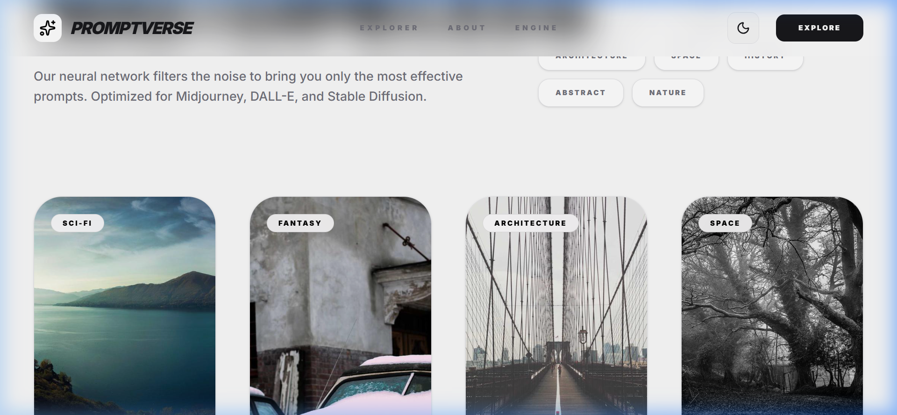

<div align="center">


# 🌌 PROMPTVERSE
### Master AI Vision & Creative Intelligence
</div>

---

## 🚀 The Visionary Series
This project is part of my **Weekly Innovation Challenge**, where I build and deploy high-utility AI tools and premium interfaces. **PromptVerse** is the first masterpiece in this series, designed to empower creators with the perfect language for image generation and photo editing.

Whether you are using **DALL-E 3**, **Midjourney**, **Stable Diffusion**, or **Nano Banana**, PromptVerse provides the neural bridge between your vision and the algorithm.

---

## ✨ Features
- **Neural Gallery**: A high-performance showcase of curated AI generations.
- **Instant Synthesis**: One-click copying of optimized prompts for immediate testing.
- **Admin Engine**: A dedicated interface for contributors to expand the multiverse with new assets and metadata.
- **Premium Aesthetics**: Editorial Magzine-style design with full Dark/Light mode support.
- **Universal Optimization**: Prompts verified to work across the leading generative landscape.

---

## 📸 Screenshots

### 🖼️ The Gallery Experience
*Explore the most sophisticated library of AI prompts.*


## 🛠️ Run Locally

**Prerequisites:** Node.js

1.  **Clone & Install**:
    ```bash
    git clone https://github.com/kaushik943/prompt-verse.git
    cd prompt-verse
    npm install
    ```

2.  **Start Dev Server**:
    ```bash
    npm run dev
    ```

---

## 🌐 Deploy
This project is optimized for deployment on **Vercel**. Every push to `main` branch automatically triggers a new production build.

---

Built with ❤️ by **Aditya Kaushik** | Weekly Project #1
